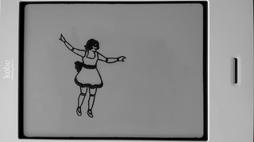

# JavaFX on E-Paper

The images below link to videos of the [JavaFX test application](https://github.com/jgneff/epd-javafx) running on a Kobo Touch Model N905C e-reader.

| Video | Description |
|:-----:|:------------|
|  | The Monocle EPD platform [system tests](test.html) |
|  | Duke, the Java mascot, [waving](duke.html) |
|  | A mechanical doll [dancing](doll.html) |
